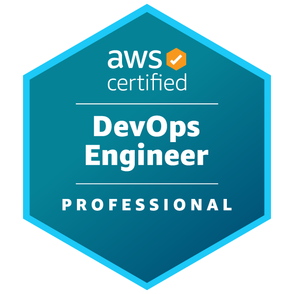

# AWS DevOps Professional Note

## สารบัญ

| **หัวข้อ**                             | **คำอธิบาย**                                                                 | **Link**                                                                 |
|-----------------------------------------|---------------------------------------------------------------------------------|--------------------------------------------------------------------------|
| **SDLC Automation**                     | ครอบคลุมแนวปฏิบัติด้านการทำงานอัตโนมัติในวงจรการพัฒนา Software (SDLC)      | [SDLC Automation](/1.SDLC%20Automation.md)                               |
| **Configuration Management and IaC**    | Focuses on Infrastructure as Code (IaC) and configuration management tools.     | [Configuration Management and IaC](/2.Configuration%20Management%20and%20IaC.md) |
| **Resilient Cloud Solutions**           | Discusses strategies for building resilient and fault-tolerant systems on AWS.  | [Resilient Cloud Solutions](/3.Resilient%20Cloud%20Solutions.md)         |
| **Monitoring and Logging**              | Explains monitoring, logging, and observability practices using AWS services.   | [Monitoring and Logging](/4.Monitoring%20and%20Logging.md)               |
| **Incident and Event Response**         | Details incident management and event-driven automation on AWS.                | [Incident and Event Response](/5.Incident%20and%20event%20response.md)   |
| **Security and Compliance**             | Covers security best practices and compliance standards in AWS environments.    | [Security and Compliance](/6.Security%20and%20Compliance.md)             |
| **More AWS Services to Focus**          | Highlights additional AWS services critical for DevOps professionals.           | [More AWS Services to Focus](/7.More%20AWS%20Services%20to%20Focus.md)   |
| **AWS Cheatsheet**                      | A quick reference guide for key AWS services and concepts.                      | [AWS Cheatsheet](/8.%20AWS%20Cheatsheet.md)                              |
| **Exam Tips**                           | Provides strategies and best practices for exam preparation, including AWS core services and the Well-Architected Framework. | Included in the main document                                            |
| **Common Pitfalls**                     | Warns against common mistakes, such as using exam dumps.                        | Included in the main document                                            |
| **Courses**                             | Recommends Stephane Maarek's Udemy course for comprehensive exam preparation.   | [Udemy Course](https://www.udemy.com/course/aws-certified-devops-engineer-professional-hands-on/) |
| **Labs**                                | Suggests CloudAcademy labs for hands-on practice with AWS DevOps tools.         | [CloudAcademy Labs](https://cloudacademy.com/learning-paths/aws-devops-engineer-professional-dop-c02-certification-preparation-for-aws-1-9637/?program=1acec0f4-f7a7-44b8-9768-ad8792c9ba6d) |
| **Practice Exams**                      | Recommends Dojo Tutorials for realistic practice exams.                         | [Dojo Tutorials Practice Exams](https://tutorialsdojo.com/aws-certified-devops-engineer-professional/) |
| **Additional Resources**                | Lists AWS official documentation, whitepapers, and the DevOps blog.             | Included in the main document                                            |
| **FAQ**                                 | Answers common questions about exam preparation and study duration.             | Included in the main document                                            |
| **Contributions**                       | Encourages community contributions to improve the notes via pull requests.      | Included in the main document                                            |

## Exam Tips
- Understand the core AWS services, especially those related to computing, storage, and networking.
- Know how to secure your AWS environment using IAM roles, policies, and best practices.
- Be familiar with the AWS Well-Architected Framework to build secure, high-performing, resilient, and efficient infrastructure.
- Practice with AWS Free Tier to gain hands-on experience.
- Use AWS documentation and whitepapers as they are excellent resources for deepening your understanding and preparing for the exam.

## Common Pitfalls
- Don't use Exam Dumps 

## Courses

### Stephane Maarek's AWS Certified DevOps Engineer Professional Course
- **Description**: Stephane Maarek's course is renowned for its comprehensive coverage of all the exam objectives, detailed explanations, and practical insights. Ideal for beginners and experienced professionals alike.
- **Platform**: [Udemy](https://www.udemy.com/course/aws-certified-devops-engineer-professional-hands-on/)
- **Instructor**: Stephane Maarek

## Labs

### CloudAcademy Labs for AWS DevOps Professional
- **Description**: CloudAcademy offers hands-on labs specifically tailored for the AWS DevOps Professional certification. These labs provide practical experience with AWS services and DevOps practices.
- **Platform**: [CloudAcademy - AWS DevOps Labs](https://cloudacademy.com/learning-paths/aws-devops-engineer-professional-dop-c02-certification-preparation-for-aws-1-9637/?program=1acec0f4-f7a7-44b8-9768-ad8792c9ba6d)

## Practice Exams

### Dojo Tutorials Practice Exam Papers
- **Description**: Dojo Tutorials offers a set of practice exams that mimic the format and difficulty level of the actual AWS DevOps Professional certification exam. Great for assessing your readiness and familiarizing yourself with the exam structure.
- **Platform**: [Dojo Tutorials - AWS DevOps Professional Practice Exams](https://tutorialsdojo.com/aws-certified-devops-engineer-professional/)

## Additional Resources
- **AWS Official Documentation**: Deep dive into the [AWS Documentation](https://docs.aws.amazon.com/) to understand the intricacies of each service covered in the exam.
- **AWS Whitepapers and Guides**: Explore the [AWS Whitepapers](https://aws.amazon.com/whitepapers/) for in-depth discussions on best practices, technical guides, and reference material.
- **AWS DevOps Blog**: The [AWS DevOps Blog](https://aws.amazon.com/blogs/devops/) is a fantastic resource for learning about new tools, practices, and strategies in AWS DevOps.

## FAQ
- **Q: How long does it take to prepare for the AWS DevOps Professional certification?**
  - A: Preparation time varies by individual based on prior experience and daily study time. On average, 2-3 months of consistent study is recommended.

- **Q: Are hands-on labs necessary for passing the exam?**
  - A: Yes, practical experience is crucial. AWS emphasizes hands-on knowledge, and labs provide an excellent way to gain real-world experience with AWS services.

## Contributions
To improve these notes and add more information, feel free to contribute by opening a PR.

| **Type**               | **Resource**                                      | **Cost**       | **Link**                                                                 |
|------------------------|---------------------------------------------------|----------------|--------------------------------------------------------------------------|
| **Official Resources** | Exam Guide                                       | Free           | [AWS Certification](https://aws.amazon.com/certification/certified-devops-engineer-professional/) |
|                        | Practice Question Set                            | Free (via Skill Builder) | [AWS Skill Builder](https://aws.amazon.com/skillbuilder/)                |
|                        | Learning Plans                                   | Free           | [AWS Learning Plans](https://aws.amazon.com/learning-plans/)             |
|                        | Exam Prep Courses                                | Free/Subscription | [AWS Skill Builder](https://aws.amazon.com/skillbuilder/)                |
| **Paid Courses**       | Udemy - AWS Certified DevOps Engineer Professional 2023 - Hands On! | Paid           | [Udemy Course](https://www.udemy.com/course/aws-certified-devops-engineer-professional-hands-on/) |
|                        | Pluralsight - AWS Certified DevOps Engineer - Professional (DOP-C02) | Paid           | [Pluralsight](https://www.pluralsight.com/cloud-guru/courses/aws-certified-devops-engineer-professional-dop-c02) |
|                        | Whizlabs - AWS Certified DevOps Engineer - Professional (DOP-C02) | Paid           | [Whizlabs](https://www.whizlabs.com/aws-devops-certification-training/)  |
|                        | Coursera - DevOps on AWS Specialization          | Paid           | [Coursera](https://www.coursera.org/specializations/aws-devops)          |
| **Free Courses**       | AWS Skill Builder - Exam Readiness: AWS Certified DevOps Engineer - Professional | Free           | [AWS Skill Builder](https://aws.amazon.com/skillbuilder/courses/exam-readiness-aws-certified-devops-engineer-professional) |
|                        | AWS Learning Plans - DevOps Engineering on AWS   | Free           | [AWS Learning Plans](https://aws.amazon.com/learning-plans/)             |
| **Practice Exams**     | ExamTopics - Free Practice Questions for DOP-C02 | Free           | [ExamTopics](https://www.examtopics.com/exams/amazon/aws-certified-devops-engineer-professional-dop-c02/) |
|                        | Tutorials Dojo - AWS Certified DevOps Engineer Professional Practice Exams DOP-C02 | Paid           | [Tutorials Dojo](https://portal.tutorialsdojo.com/courses/aws-certified-devops-engineer-professional-practice-exams/) |
|                        | AWS Official Practice Exams                      | Subscription   | [AWS Skill Builder](https://aws.amazon.com/skillbuilder/)                |
| **Study Guides/Notes** | Medium - How I Conquered the AWS Certified DevOps Engineer Professional Exam in 60 Days | Free           | [Damien Burks](https://damienjburks.com/how-i-conquered-the-aws-devops-professional-exam-in-60-days) |
|                        | Medium - AWS Certified DevOps Engineer Journey: From Associate to Professional | Free           | [Medium Article](https://medium.com/@Amet13/aws-devops-certification-ea08b0b69a7c) |
|                        | Medium - 5 Best Courses for AWS Certified DevOps Engineer Professional DOP-C02 Certification in 2024 | Free           | [Javarevisited](https://medium.com/javarevisited/5-best-courses-for-aws-certified-devops-engineer-professional-dop-c02-certification-in-2023-c3785efb8782) |
|                        | Towards the Cloud - Free Exam Guide: AWS Certified DevOps Engineer – Professional | Free           | [Towards the Cloud](https://towardsthecloud.com/aws-devops-engineer-professional-exam-guide) |
|                        | Spacelift - AWS Certified DevOps Engineer - Professional [Cheat Sheet] | Free           | [Spacelift](https://spacelift.io/blog/aws-certified-devops-engineer-professional) |
| **Community Resources**| Reddit - r/AWSCertification                      | Free           | [Reddit](https://www.reddit.com/r/awscertification/)                     |
|                        | Stack Overflow - Relevant Questions              | Free           | Search on [Stack Overflow](https://stackoverflow.com/)                   |
|                        | AWS Developer Community                          | Free           | [AWS Developer Community](https://developer.aws/community/)              |
| **Additional Resources**| AWS Documentation                               | Free           | [AWS Docs](https://docs.aws.amazon.com/)                                |
|                        | AWS Whitepapers                                  | Free           | [AWS Whitepapers](https://aws.amazon.com/whitepapers/)                   |
|                        | AWS Blog                                         | Free           | [AWS Blog](https://aws.amazon.com/blogs/)                               |

